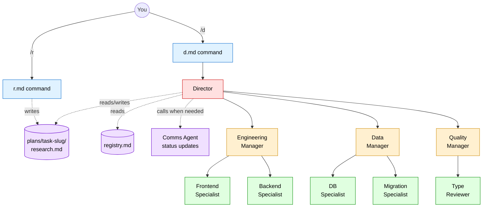
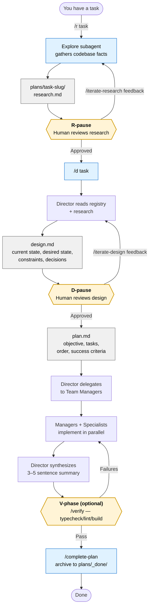
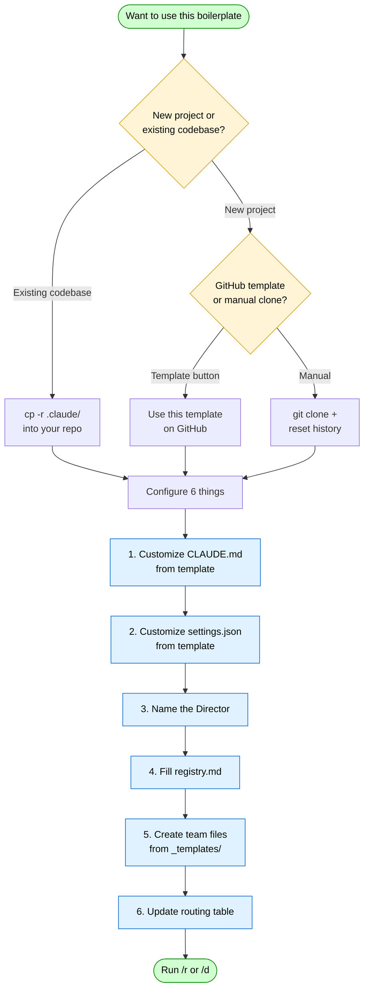

# Claude Agent Boilerplate

A GitHub template for wiring up the **QRSPI multi-agent workflow** in any codebase. Drop it in, fill in four files, and you get a working `/r` + `/d` pipeline powered by Claude Code agents.

---

## What's included

```
CLAUDE.md.template            # Project-root config template — what Claude reads on every session
.claude/
  settings.json.template      # Permissions, hooks, additionalDirectories template
  commands/
    r.md                      # /r — research phase of QRSPI
    d.md                      # /d — launches the Director
    iterate-research.md       # /iterate-research — re-run research with feedback
    iterate-design.md         # /iterate-design — re-run design with feedback
    verify.md                 # /verify — typecheck/lint/build after implementation
    complete-plan.md          # /complete-plan — archive a finished plan
  agents/
    director.md               # Orchestrator: reads registry, delegates, synthesizes
    registry.md               # Team roster: who owns what
    comms-agent.md            # Status updates to the user
    _templates/
      manager.md              # Template for creating a new team manager
      specialist.md           # Template for creating a new domain specialist
  skills/                     # Experimental — same prompts as commands, callable by other agents
    r/SKILL.md
    d/SKILL.md
docs/
  multi-repo.md               # Coordination repo pattern for multi-repo features
examples/
  universal-rn-nextjs-monorepo/  # Worked example: filled-in agents + sample plans/
```

---

## How the agents fit together



The team structure above is just an example — you define your own teams and specialists in `registry.md`. The Director, Comms Agent, and command structure stay the same.

---

## The QRSPI Workflow

QRSPI is a structured pattern for tackling complex engineering tasks with AI agents:

| Phase | Who | What happens |
|-------|-----|-------------|
| **Q**uestions | Human (you) | Human-written questions about the task — what to build, constraints, edge cases, anything ambiguous. Passed into the `/r` step so research can target them. |
| **R**esearch | `/r` command | Explore subagent gathers facts — files, patterns, data flows, types, collision points. No opinions. |
| **S**pecification / Design | Director | Director writes a design doc. Human reviews and corrects before any code is written. |
| **P**lan | Director | Director writes a plan grounded in the approved design. |
| **I**mplementation | Team Managers + Specialists | Managers break work into specialist assignments. Specialists implement. |

**The two gates** (R-pause and D-pause) are built into the Director. The Director always stops after research and after design to get human confirmation. This prevents wasted work from building on wrong assumptions.



The yellow gates are the load-bearing parts. The R-pause and D-pause prevent agents from building on wrong assumptions; the V-phase prevents declaring done before the change actually works. Iteration commands (`/iterate-research`, `/iterate-design`) make the rejection path explicit — one command to redo a phase with corrective feedback.

---

## Prerequisites

- **Claude Code** CLI installed and authenticated (`claude` in your PATH) — [install guide](https://docs.anthropic.com/en/docs/claude-code/getting-started)
- A git repository with **at least one commit** — Claude Code agents that run in worktree isolation mode need a commit to branch from
- Branch named **`main`** (not `master`) — recommended for consistency with GitHub defaults and Claude Code tooling
- A `plans/` directory will be created automatically at your repo root when you first run `/r` or `/d`; add it to `.gitignore` if you don't want plans committed

### A note on git worktrees

Some agents in this workflow run in **worktree isolation** — Claude Code spins up a temporary git worktree so the agent's changes don't touch your working tree until you review them. The runner creates and cleans up worktrees automatically. What you need to support this:

1. A git repo with at least one commit (so there's a base to branch from)
2. A reasonably clean working tree before launching agents — uncommitted changes in your working tree won't appear in the agent's isolated copy
3. If the agent makes changes, the worktree path and branch are returned so you can review and merge on your own terms

---

## Setup



Choose the path that matches your situation:

- [Adding to an existing codebase](#adding-to-an-existing-codebase)
- [Starting a new project from scratch](#starting-a-new-project-from-scratch)

Then continue with [Configuring for your project](#configuring-for-your-project).

---

### Adding to an existing codebase

Copy the `.claude/` directory and the project-root templates into your repo:

```bash
BOILER=/path/to/claude-agent-boilerplate
PROJECT=/path/to/your-project

# Agent infrastructure
cp -r $BOILER/.claude $PROJECT/

# Project-root templates (you'll customize these)
cp $BOILER/CLAUDE.md.template $PROJECT/

# Optional but recommended docs
cp -r $BOILER/docs $PROJECT/
```

If your project already has a `.claude/` directory, merge selectively — the key directories to add are `.claude/commands/`, `.claude/agents/`, and `.claude/skills/`. If you already have a `CLAUDE.md`, merge in the "How to work in this repo" section from the template instead of replacing.

Then add `plans/` to your `.gitignore` so the `_done/` history is the only plan directory committed:

```bash
echo "/plans/" >> .gitignore   # only the root plans/, not nested ones in examples/
```

---

### Starting a new project from scratch

**Option A — GitHub template (recommended)**

1. On GitHub, open this repo and click **"Use this template" → "Create a new repository"**
2. Clone your new repo locally
3. Add your project's source code alongside the `.claude/` directory
4. Continue with [Configuring for your project](#configuring-for-your-project)

**Option B — Manual clone**

```bash
git clone https://github.com/loschenbd/claude-agent-boilerplate my-new-project
cd my-new-project

# Start fresh history
rm -rf .git && git init && git branch -m main

# Initial commit (required — worktree isolation needs at least one commit)
git add . && git commit -m "chore: init from claude-agent-boilerplate"

# Set up a remote (recommended for team use and pushing agent worktree branches)
gh repo create my-new-project --public --source . --remote origin --push
# or manually:
# git remote add origin https://github.com/<you>/my-new-project.git
# git push -u origin main
```

Then add your project source and continue below.

---

### Configuring for your project

There are six things to fill in. The first two are foundational; the rest define your teams.

**Step 1 — Project-root `CLAUDE.md`**

Rename `CLAUDE.md.template` → `CLAUDE.md` and replace the placeholders with your project's stack, layout, and conventions. Claude Code reads this on every session — it's how the AI knows the QRSPI workflow exists.

```bash
mv CLAUDE.md.template CLAUDE.md
# then edit it
```

**Step 2 — `.claude/settings.json`**

Rename `settings.json.template` → `settings.json` and customize permissions, hooks, and `additionalDirectories` (for multi-repo). The template uses `_comment_*` keys for inline guidance — JSON doesn't support real comments, so **strip those keys before saving**.

```bash
cd .claude && mv settings.json.template settings.json
# then edit it — strip the _comment_* keys
```

**Step 3 — Name the Director**

In `.claude/agents/director.md`, replace `[PROJECT NAME]` at the top with your project name.

**Step 4 — Fill in the registry**

In `.claude/agents/registry.md`, replace the placeholder team sections with your actual teams and specialists. There's a commented example for each field — delete the comments once filled in.

**Step 5 — Create your team files**

For each team, copy the templates and fill them in:

```bash
# Example: creating an engineering team with two specialists
mkdir -p .claude/agents/engineering
cp .claude/agents/_templates/manager.md .claude/agents/engineering/manager.md
cp .claude/agents/_templates/specialist.md .claude/agents/engineering/frontend-expert.md
cp .claude/agents/_templates/specialist.md .claude/agents/engineering/backend-expert.md
```

Every `[placeholder]` in the template is something you fill in. The surrounding structure stays the same. Delete the instruction comments before committing.

A filled-in tree looks like:

```
.claude/agents/
  engineering/
    manager.md
    frontend-expert.md
    backend-expert.md
  data/
    manager.md
    db-specialist.md
  _templates/          # keep these for future teams
    manager.md
    specialist.md
```

**Step 6 — Update the Director's routing table**

In `.claude/agents/director.md`, fill in the routing table to map task categories to your managers:

```markdown
| If the task involves... | Route to |
|------------------------|----------|
| UI components          | `engineering/manager` → frontend-expert |
| Database schema        | `data/manager` → db-specialist |
```

---

### Publishing as a GitHub template (optional)

If you want your configured version to be reusable by your team:

1. Push to GitHub
2. Go to **Settings → General** and check **"Template repository"**
3. Team members can now click **"Use this template"** to bootstrap new projects with your org's agent setup already configured

---

## Usage

### Commands

| Command | When to use |
|---------|-------------|
| `/r <task>` | Start of any complex change. Gathers facts; produces `research.md`. No code changes. |
| `/d <task>` | Run the full QRSPI flow: design → plan → delegate → synthesize. Will pause for your review at R-pause and D-pause. |
| `/iterate-research <feedback>` | After rejecting `research.md` — re-runs research with corrective feedback. |
| `/iterate-design <feedback>` | After rejecting `design.md` — re-runs design with corrective feedback. |
| `/verify` | After implementation — runs typecheck/lint/build and reports failures. Optional V-phase. |
| `/complete-plan` | After all plan tasks are done — writes a wrap-up and archives the plan to `plans/_done/`. |

### Typical flow

```bash
/r <describe your task or paste a ticket>
# review plans/<slug>/research.md
# if wrong: /iterate-research <feedback>

/d <your task description>
# review design.md at the D-pause
# if wrong: /iterate-design <feedback>
# review plan.md, confirm
# implementation runs, Director synthesizes

/verify   # optional but recommended

/complete-plan   # archives the work with a wrap-up
```

### Resuming interrupted sessions

If a session ends mid-task, the Director writes `plans/<task-slug>/progress.md` after each phase. Running `/d <same task>` in a new session picks up from where it left off.

---

## Customization contract

| What to customize | What to leave alone |
|-------------------|---------------------|
| `CLAUDE.md.template` (rename + fill in) | QRSPI phase logic in director.md (steps 1–7) |
| `.claude/settings.json.template` (rename, strip `_comment_*` keys) | R-pause / D-pause / V-phase gate behavior |
| Project name in director.md | research.md command structure |
| Routing table in director.md | iterate-research.md / iterate-design.md / verify.md / complete-plan.md |
| registry.md team roster | comms-agent.md behavior |
| Agent files for your teams (from `_templates/`) | progress.md format |
| Team layout under `.claude/agents/` | Skill format under `.claude/skills/` (still experimental) |

---

## Tips

- **Keep registry.md current.** The Director reads it on every task. Stale entries cause misrouting.
- **Be specific in specialist files.** The more concrete the expertise section (file paths, library names, patterns), the better the specialist performs.
- **Use the Comms Agent.** Wire your managers to call it for milestone updates and blockers — it keeps the user informed without cluttering manager output.
- **Don't skip the R-pause.** It's tempting to confirm immediately and charge ahead, but reading the research doc catches wrong assumptions before they become wrong implementations.

---

## Worked example

See [`examples/universal-rn-nextjs-monorepo/`](examples/universal-rn-nextjs-monorepo/) for a fully configured version of this boilerplate plus sample artifacts from a real QRSPI run.

It includes:

- A filled-in `.claude/` for a universal React Native + Next.js monorepo: 4 teams, 17 specialists, complete routing table, cross-team conventions
- Sample plan artifacts at `examples/.../plans/example-add-csv-export/` — `research.md`, `design.md`, `plan.md`, and `progress.md` for a realistic feature, showing exactly what each QRSPI phase produces

[**→ Browse the example**](examples/universal-rn-nextjs-monorepo/)

---

## Multi-repo workflow

For features spanning multiple repos, see [`docs/multi-repo.md`](docs/multi-repo.md). It covers the **coordination repo pattern** — keeping QRSPI agents in a dedicated `coordination/` repo that drives work across sibling repos via `additionalDirectories`, plus an optional `workspaces/<task-slug>/` worktree layout for parallel tasks.

---

## Skills (experimental)

`.claude/skills/r/SKILL.md` and `.claude/skills/d/SKILL.md` mirror the slash commands in skill format, so other agents/skills can invoke them programmatically (not just the user typing `/r`). The skill format is still evolving, so these are experimental — the slash commands remain the primary entry point.

---

## Credits

The QRSPI methodology is inspired by the work of [Dex Horthy](https://github.com/dexhorthy) and [HumanLayer](https://github.com/humanlayer) on structured human-in-the-loop AI agent workflows, with additional thanks to [Jerry Bruns](https://devjerry.me) ([@devjerry0](https://github.com/devjerry0)). This boilerplate is [Benjamin Loschen](https://github.com/loschenbd)'s adaptation of those ideas for Claude Code.

Built on [Claude Code](https://docs.anthropic.com/en/docs/claude-code) by [Anthropic](https://www.anthropic.com) — the agentic coding tool that powers the `/r` and `/d` commands, the Director, and all specialist agents in this workflow.
