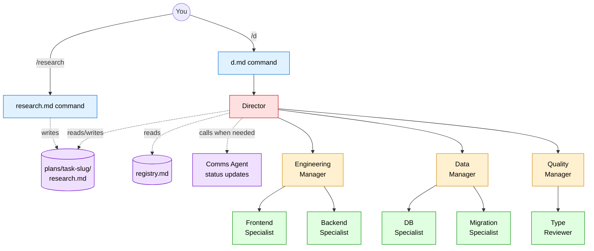
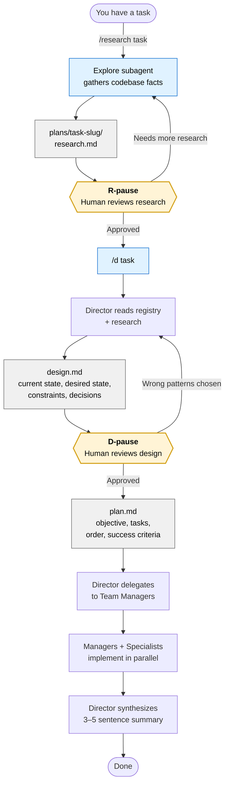
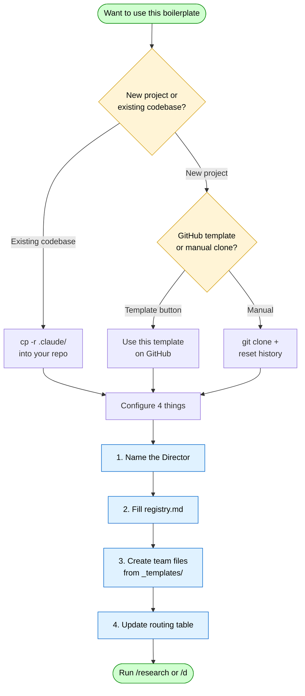

# Claude Agent Boilerplate

A GitHub template for wiring up the **QRSPI multi-agent workflow** in any codebase. Drop it in, fill in four files, and you get a working `/research` + `/d` pipeline powered by Claude Code agents.

---

## What's included

```
.claude/
  commands/
    research.md     # /research command — research phase of QRSPI
    d.md            # /d command — launches the Director
  agents/
    director.md     # Orchestrator: reads registry, delegates, synthesizes
    registry.md     # Team roster: who owns what
    comms-agent.md  # Status updates to the user
    _templates/
      manager.md    # Template for creating a new team manager
      specialist.md # Template for creating a new domain specialist
```

---

## How the agents fit together



The team structure above is just an example — you define your own teams and specialists in `registry.md`. The Director, Comms Agent, and command structure stay the same.

---

## The QRSPI Workflow

QRSPI is a structured pattern for tackling complex engineering tasks with AI agents:

| Phase | Who | What happens |
|-------|-----|-------------|
| **R**esearch | `/research` command | Explore subagent gathers facts — files, patterns, data flows, types, collision points. No opinions. |
| **Q**uestions / **D**esign | Director | Director writes a design doc. Human reviews and corrects before any code is written. |
| **S**pecification / **P**lan | Director | Director writes a plan grounded in the approved design. |
| **I**mplementation | Team Managers + Specialists | Managers break work into specialist assignments. Specialists implement. |

**The two gates** (R-pause and D-pause) are built into the Director. The Director always stops after research and after design to get human confirmation. This prevents wasted work from building on wrong assumptions.



The two yellow gates are the load-bearing parts. Without them, the agents will happily build on wrong assumptions. The pauses force you to read the artifacts and correct course before any code is touched.

---

## Prerequisites

- **Claude Code** CLI installed and authenticated (`claude` in your PATH) — [install guide](https://docs.anthropic.com/en/docs/claude-code/getting-started)
- A git repository with **at least one commit** — Claude Code agents that run in worktree isolation mode need a commit to branch from
- Branch named **`main`** (not `master`) — recommended for consistency with GitHub defaults and Claude Code tooling
- A `plans/` directory will be created automatically at your repo root when you first run `/research` or `/d`; add it to `.gitignore` if you don't want plans committed

### A note on git worktrees

Some agents in this workflow run in **worktree isolation** — Claude Code spins up a temporary git worktree so the agent's changes don't touch your working tree until you review them. The runner creates and cleans up worktrees automatically. What you need to support this:

1. A git repo with at least one commit (so there's a base to branch from)
2. A reasonably clean working tree before launching agents — uncommitted changes in your working tree won't appear in the agent's isolated copy
3. If the agent makes changes, the worktree path and branch are returned so you can review and merge on your own terms

---

## Setup



Choose the path that matches your situation:

- [Adding to an existing codebase](#adding-to-an-existing-codebase)
- [Starting a new project from scratch](#starting-a-new-project-from-scratch)

Then continue with [Configuring for your project](#configuring-for-your-project).

---

### Adding to an existing codebase

Copy the `.claude/` directory into your repo root:

```bash
cp -r /path/to/claude-agent-boilerplate/.claude /path/to/your-project/
```

If your project already has a `.claude/` directory, merge selectively — the key directories to add are `.claude/commands/` and `.claude/agents/`.

Then add `plans/` to your `.gitignore` if you don't want research and design docs committed:

```bash
echo "plans/" >> .gitignore
```

---

### Starting a new project from scratch

**Option A — GitHub template (recommended)**

1. On GitHub, open this repo and click **"Use this template" → "Create a new repository"**
2. Clone your new repo locally
3. Add your project's source code alongside the `.claude/` directory
4. Continue with [Configuring for your project](#configuring-for-your-project)

**Option B — Manual clone**

```bash
git clone https://github.com/loschenbd/claude-agent-boilerplate my-new-project
cd my-new-project

# Start fresh history
rm -rf .git && git init && git branch -m main

# Initial commit (required — worktree isolation needs at least one commit)
git add . && git commit -m "chore: init from claude-agent-boilerplate"

# Set up a remote (recommended for team use and pushing agent worktree branches)
gh repo create my-new-project --public --source . --remote origin --push
# or manually:
# git remote add origin https://github.com/<you>/my-new-project.git
# git push -u origin main
```

Then add your project source and continue below.

---

### Configuring for your project

**Step 1 — Name the Director**

In `.claude/agents/director.md`, replace `[PROJECT NAME]` at the top with your project name.

**Step 2 — Fill in the registry**

In `.claude/agents/registry.md`, replace the placeholder team sections with your actual teams and specialists. There's a commented example for each field — delete the comments once filled in.

**Step 3 — Create your team files**

For each team, copy the templates and fill them in:

```bash
# Example: creating an engineering team with two specialists
mkdir -p .claude/agents/engineering
cp .claude/agents/_templates/manager.md .claude/agents/engineering/manager.md
cp .claude/agents/_templates/specialist.md .claude/agents/engineering/frontend-expert.md
cp .claude/agents/_templates/specialist.md .claude/agents/engineering/backend-expert.md
```

Every `[placeholder]` in the template is something you fill in. The surrounding structure stays the same. Delete the instruction comments before committing.

A filled-in tree looks like:

```
.claude/agents/
  engineering/
    manager.md
    frontend-expert.md
    backend-expert.md
  data/
    manager.md
    db-specialist.md
  _templates/          # keep these for future teams
    manager.md
    specialist.md
```

**Step 4 — Update the Director's routing table**

In `.claude/agents/director.md`, fill in the routing table to map task categories to your managers:

```markdown
| If the task involves... | Route to |
|------------------------|----------|
| UI components          | `engineering/manager` → frontend-expert |
| Database schema        | `data/manager` → db-specialist |
```

---

### Publishing as a GitHub template (optional)

If you want your configured version to be reusable by your team:

1. Push to GitHub
2. Go to **Settings → General** and check **"Template repository"**
3. Team members can now click **"Use this template"** to bootstrap new projects with your org's agent setup already configured

---

## Usage

Once set up, the workflow is:

```
# Start with research (optional but recommended)
/research <describe your task or paste a ticket>

# Review plans/<task-slug>/research.md, then launch the Director
/d <your task description>
```

The Director will:
1. Check for existing research
2. Write a design doc and pause for your review
3. Write an implementation plan and pause for your review
4. Delegate to teams and synthesize results

### Resuming interrupted sessions

If a session ends mid-task, the Director writes `plans/<task-slug>/progress.md` after each phase. Running `/d <same task>` in a new session picks up from where it left off.

---

## Customization contract

| What to customize | What to leave alone |
|-------------------|---------------------|
| Project name in director.md | QRSPI phase logic (steps 1–7) |
| Routing table in director.md | R-pause and D-pause gates |
| registry.md team roster | research.md command structure |
| Agent files for your teams | comms-agent.md behavior |
| _templates/ (fill in, then delete comments) | progress.md format |

---

## Tips

- **Keep registry.md current.** The Director reads it on every task. Stale entries cause misrouting.
- **Be specific in specialist files.** The more concrete the expertise section (file paths, library names, patterns), the better the specialist performs.
- **Use the Comms Agent.** Wire your managers to call it for milestone updates and blockers — it keeps the user informed without cluttering manager output.
- **Don't skip the R-pause.** It's tempting to confirm immediately and charge ahead, but reading the research doc catches wrong assumptions before they become wrong implementations.

---

## Worked example

See [`examples/gemify-universal/`](examples/gemify-universal/) for a real, working configuration of this boilerplate.

It's the actual `.claude/` setup from a universal React Native + Next.js monorepo: 4 teams, 17 specialists, a fully filled-in routing table, and cross-team conventions. Useful when you want to see what "filled in" looks like before adapting the templates to your own project.

[**→ Browse the example**](examples/gemify-universal/)

---

## Credits

The QRSPI methodology is inspired by the work of [Dex Horthy](https://github.com/dexhorthy) and [HumanLayer](https://github.com/humanlayer) on structured human-in-the-loop AI agent workflows, with additional thanks to [Jerry Bruns](https://devjerry.me) ([@devjerry0](https://github.com/devjerry0)). This boilerplate is [Benjamin Loschen](https://github.com/loschenbd)'s adaptation of those ideas for Claude Code.

Built on [Claude Code](https://docs.anthropic.com/en/docs/claude-code) by [Anthropic](https://www.anthropic.com) — the agentic coding tool that powers the `/research` and `/d` commands, the Director, and all specialist agents in this workflow.
